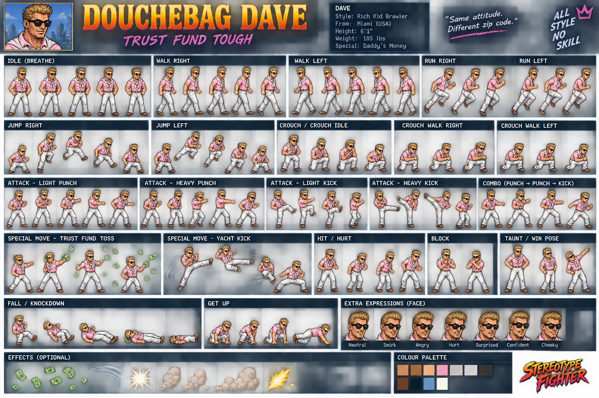
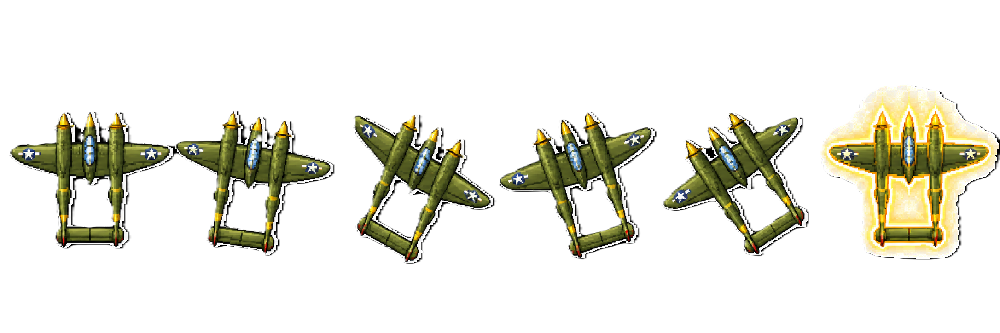
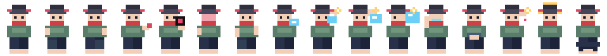

# RetroGames

**A homemade browser arcade by Andrew Bartlett.** Four game families, eight distinct playable builds, and one archived duplicate. No accounts or game installation required.

## [Open the RetroGames arcade](https://bartandrew.github.io/RetroGames/)

The main page has artwork from each game, descriptions, controls, genre filters, search, a random-game button, and direct links to every playable version. The latest build in each family gets the main Play button. These are evolving prototypes, not finished commercial games.

## The games

### Stereotype Fighters

[](https://bartandrew.github.io/RetroGames/StereoTypeFighter/)

An 18-character retro fighter using original character artwork. Play against the CPU at three difficulties, challenge a friend on one keyboard, or use Practice mode. The current arena is the procedural Neon Quarter. Some animation poses are fallbacks, and specials currently share a short-range implementation.

**[Play Stereotype Fighters](https://bartandrew.github.io/RetroGames/StereoTypeFighter/)** · [Controls and development notes](StereoTypeFighter/README.md)

### Pacific Lightning

[](https://bartandrew.github.io/RetroGames/Pacific-Lightning2/Pacific-Lightning/)

A vertical arcade shooter: fly a P-38 through enemy waves, attack ships, battle bosses and collect weapon or shield power-ups. The featured version uses the expanded sprite artwork; the original procedural build is also preserved.

**[Play Pacific Lightning](https://bartandrew.github.io/RetroGames/Pacific-Lightning2/Pacific-Lightning/)** · [Controls and development notes](Pacific-Lightning2/Pacific-Lightning/README.md)

### Sandbag Siege

[](https://bartandrew.github.io/RetroGames/SandbagSiege_V2/SandbagSiege/)

V2 is a first-person arcade shooter with movement, mouse aiming, medkits, grenades and a gunship boss. The original is a fixed shooting gallery where the player pops up from behind sandbags to defend the ridge.

**[Play Sandbag Siege V2](https://bartandrew.github.io/RetroGames/SandbagSiege_V2/SandbagSiege/)** · [Controls and development notes](SandbagSiege_V2/SandbagSiege/README.md)

### Left Vs Right

[](https://bartandrew.github.io/RetroGames/left-vs-right3/left-vs-right/)

A four-character parody fighter with CPU and local two-player modes. V3 expands the fighters' sprite sheets. All three builds remain accessible for comparison.

**[Play Left Vs Right V3](https://bartandrew.github.io/RetroGames/left-vs-right3/left-vs-right/)** · [Controls and development notes](left-vs-right3/left-vs-right/README.md)

*The images above are original game artwork, not gameplay screenshots.*

## Every playable entry point

| Game / version | Launch | Repository folder |
| --- | --- | --- |
| Stereotype Fighters V5.1 | [Play](https://bartandrew.github.io/RetroGames/StereoTypeFighter/) | `StereoTypeFighter/` |
| Pacific Lightning, sprite build | [Play](https://bartandrew.github.io/RetroGames/Pacific-Lightning2/Pacific-Lightning/) | `Pacific-Lightning2/Pacific-Lightning/` |
| Pacific Fighter, original | [Play](https://bartandrew.github.io/RetroGames/PacificFighter/) | `PacificFighter/` |
| Pacific Fighter, archived duplicate | [Play](https://bartandrew.github.io/RetroGames/PacificFighter/Pacific-Lightning/Pacific-Lightning/) | `PacificFighter/Pacific-Lightning/Pacific-Lightning/` |
| Sandbag Siege V2 | [Play](https://bartandrew.github.io/RetroGames/SandbagSiege_V2/SandbagSiege/) | `SandbagSiege_V2/SandbagSiege/` |
| Sandbag Siege, original | [Play](https://bartandrew.github.io/RetroGames/SandbagSiege_Project/SandbagSiege/) | `SandbagSiege_Project/SandbagSiege/` |
| Left Vs Right V3 | [Play](https://bartandrew.github.io/RetroGames/left-vs-right3/left-vs-right/) | `left-vs-right3/left-vs-right/` |
| Left Vs Right V2 | [Play](https://bartandrew.github.io/RetroGames/left-vs-right2/left-vs-right/) | `left-vs-right2/left-vs-right/` |
| Left Vs Right, original | [Play](https://bartandrew.github.io/RetroGames/left-vs-right/left-vs-right/) | `left-vs-right/left-vs-right/` |

The archived Pacific Fighter copy has identical game code to the original and is not counted as a separate build. ZIP archives are source snapshots, not extra games.

**Not yet playable:** the root `preview.html` describes Star Scrapper '84, but its referenced `game.js` and `styles.css` are absent. It is deliberately excluded from the playable directory.

## Run locally

Serve the repository over HTTP (required for Stereotype Fighters' ES modules):

```sh
python3 -m http.server 8080
# Open http://localhost:8080/
```

Desktop keyboard play is recommended. Sandbag Siege needs a mouse; Stereotype Fighters also provides Player 1 touch controls. Local two-player fighting uses one keyboard.

## Site structure and publishing

- `index.html`: the complete static directory. Game links and controls work without JavaScript.
- `arcade/arcade.css`: responsive styling, visible keyboard focus and reduced-motion support.
- `arcade/arcade.js`: optional filtering, search and random selection.
- `tools/build_site.py`: validates local launch paths and assets, then creates `_site/` with the directory and all eight game folders. Original URLs are preserved. ZIP archives are not published.
- `tools/test_build_site.py`: dependency-free build regression tests.
- `.github/workflows/publish-stereotype-fighters-pages.yml`: existing workflow file, now publishing the complete arcade on pushes to `main` rather than redirecting the root to one game.

```sh
python3 -m unittest discover -s tools -p 'test_build_site.py' -v
python3 tools/build_site.py --check
python3 tools/build_site.py
python3 -m http.server 8080 --directory _site
```

### Adding another game

Add its playable folder and a card in `index.html`, using `data-game-link` on each unique launch link. Include an image from the game, meaningful alternative text, a description and controls. Set `data-genre` / `data-keywords` for filtering. Update the counts and this README, then run the checks above. The builder derives the folders to publish from those links and flags unlisted `index.html` entry points inside staged game folders.
